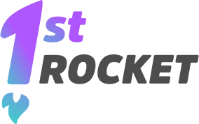

<h1 align="center">
  
</h1>

<p align="center">Ajudamos você nos primeiros passos em sua jornada empreendedora.</p>

<p align="center">
    <a href="#sobre">Sobre</a> •
    <a href="#planos">Planos futuros</a> •
    <a href="#techs">Tecnologias</a> •
    <a href="#uso">Executando</a> • <a href="#autores">Autores</a> • <a href="#licenca">Licença</a>
</p>

<h2 id="sobre">Sobre</h2>
<p>Projeto desenvolvido durante a Mega Hack 5.0, sob o desafio da InovAtiva Brasil.

O projeto ***First Rocket*** aumentar o relacionamento e engajamento online de comunidades locais, suprir a falta de mentorias e materias que alcancem empresários de todo país, inclusive os que se encontram fora de grandes centros, além de garantir a continuidade das mentorias e sucesso do projeto.

Na nossa plataforma, o empresário se cadastra, salva seu vídeo pitch, escreve um resumo sobre sua ideia e o nível de maturidade que ela se encontra. O projeto é avaliado por mentores contratados por empresas como Sebrae.  Aqueles que não receberem o match, recebm um feedback para que possam desenvolver melhor a ideia. Os aprovados, desbloqueiam mentorias que podem ser agendadas com os profissionais escolhidos, através do site. As mentorias podem ocorrer na plataforma escolhida junto ao mentor, afim de aumentar a acessibilidade.

[Design das páginas](https://xd.adobe.com/view/044d7f0c-65fb-4a96-985f-132521285b2e-511e/grid/)

<h2 id="planos">Planos futuros</h2>
<p>Devido ao curto tempo inicial de desenvolvimento da plataforma, há poucas funcionalidades. No entanto, possuímos planos para tornar a plataforma cada vez melhor:

- Conta de mentor para administrar suas mentorias agendadas e avaliar projetos pendentes
- Envio de projetos dentro da plataforma para liberação das mentorias, filtrando para termos aqueles realmente dedicados ao aprendizado
- Feedback dos mentores, para que o empresário saiba o que faltou para seu projeto encantar os profissionais e assim poder tentar novamente após concluir os estudos necessários
- Sistema de pagamentos diversos: 
  - Quando conseguir, você começa a pagar 5% do faturamento bruto mensal até atingir o valor máximo de R$ 16.000,00.
  - Modelo de Sucesso Compartilhado (MSC) você não precisa pagar nada até sua empesa começar a ter lucro.
  - modalidades de pagamento em 12 parcelas de R$ 1.000,00 ou R$ 10.000,00 à vista.
- Plataforma aberta para investidores se conectarem com os futuros empresários e talvez investirem em seus projetos, gerando renda para a plataforma
- Reuniões dentro da plataforma, assim acabando com a necessidade de migrar para uma plataforma externa para realizar as mentorias

As possibilidades são inúmeras, e com o desenvolvimento do projeto, mais ideias poderão surgir!

<h2 id="techs">Tecnologias</h2>
<h3>Front-end</h3>

- TypeScript
- ReactJS
- Styled components

<h3><a href="https://github.com/luccagdias/first-rocket">Back-end</a>

- Java

<h2 id="uso">Executando</h2>
<h3>Pré-requisito</h3>

Antes de iniciar o projeto, você precisa ter um gerenciador de pacotes: `yarn` ou `npm`.

<h3>Inicialização</h3>

Para começar, clone o projeto no diretório de sua escolha e acesse-o:
```bash
$ git clone https://github.com/EduardoRodriguesF/first-rocket.git

cd first-rocket
```
Feito isso, instale todas as dependências:
```bash
$ yarn
# ou
$ npm install
```
Tudo pronto! após executar o projeto com o comando abaixo, ele será aberto no seu [localhost](http://localhost:3000/):
```bash
$ yarn start
# ou
$ npm start
```

<h2>Autores</h2>

<div style="display: flex; flex-wrap: wrap; align-items: center; justify-content: center" align="center">
  <div style="margin: 16px;" align="center">
    
    <p><a href="https://www.linkedin.com/in/eduardo-rodrigues-4b3624190/">Eduardo Rodrigues</a> (Front-end)</p>
  </div>
  <div style="margin: 16px;" align="center">
    
    <p><a href="https://www.linkedin.com/in/luisdferrari/">Luís Ferrari</a> (Front-end)</p>
  </div>
  <div style="margin: 16px;" align="center">
    
    <p><a href="https://www.linkedin.com/in/lucca-dias-a09b61113/">Lucca Dias</a> (Back-end)</p>
  </div>
  <div style="margin: 16px;" align="center">
    
    <p><a href="https://www.linkedin.com/in/amanda-zanatta-30a87a119/">Amanda Zanatta</a> (UX/UI Designer)</p>
  </div>
  <div style="margin: 16px;" align="center">
    
    <p><a href="https://www.linkedin.com/in/araujoluiz/">Luiz Araujo</a> (MKT)</p>
  </div>
</div>

<h2 id="licenca">Licença</h2>

Este projeto está sob a [licença MIT](https://github.com/EduardoRodriguesF/first-rocket/blob/main/LICENSE).